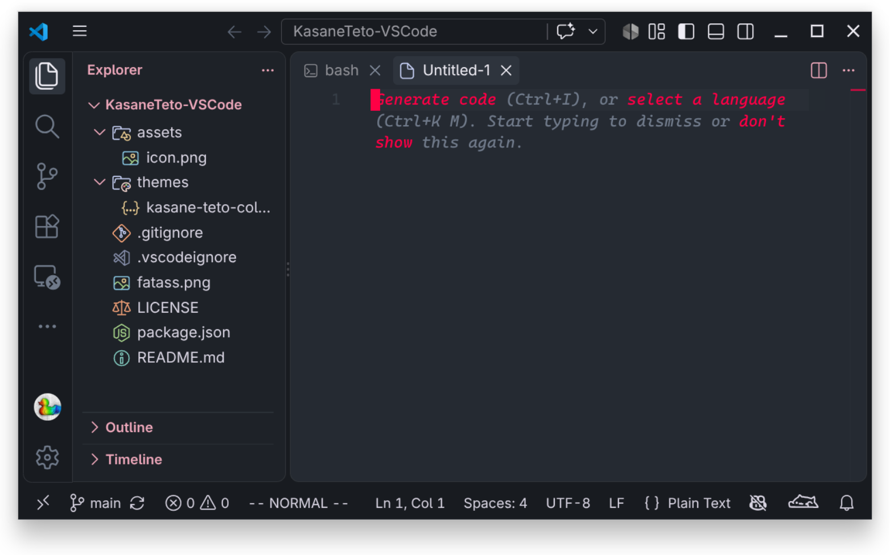

# Kasane Teto VS Code Theme (重音テト) 🥖

[](https://marketplace.visualstudio.com/items?itemName=SinsuSquid.kasane-teto-theme)
[](https://marketplace.visualstudio.com/items?itemName=SinsuSquid.kasane-teto-theme)
[](https://marketplace.visualstudio.com/items?itemName=SinsuSquid.kasane-teto-theme)

A vibrant dark VS Code theme inspired by **Kasane Teto** (UTAU / Synthesizer V).

<p align="center">
  
</p>

## 📸 Preview



## 🎨 Color Palette

| Color | Hex | RGB | Usage |
| :--- | :--- | :--- | :--- |
| **Point Accent** | `#ff0045` | `(255, 0, 69)` | Primary point color: cursor, active tab border, focus rings, buttons, function names |
| **Secondary Pink** | `#eda7ba` | `(237, 167, 186)` | Strings, parameters, JSON keys, tag attributes, active line numbers |
| **Slate Grey (Canvas)** | `#252a32` | `(37, 42, 50)` | Main editor canvas & panels |
| **Slate Grey (Borders)** | `#3f4750` | `(63, 71, 80)` | Structural borders, dividers, guide lines, inactive elements |
| **Vibrant Magenta** | `#d924d5` | `(217, 36, 213)` | Keywords, control flow, operators, storage types |
| **Midnight Navy** | `#06053b` | `(6, 5, 59)` | Deep contrasting tone |

---

## 🚀 Installation

### Option 1: VS Code Marketplace
Install directly from the [Visual Studio Marketplace](https://marketplace.visualstudio.com/items?itemName=SinsuSquid.kasane-teto-theme) or via command line:

```bash
code --install-extension SinsuSquid.kasane-teto-theme
```

### Option 2: Local Development Link (Instant Hot-Reload)
Link the repository directly into your VS Code extensions folder:

```bash
ln -sfn "$(pwd)" ~/.vscode/extensions/kasane-teto-theme
```

Then in VS Code:
1. Press `Ctrl+Shift+P` (or `Cmd+Shift+P` on macOS) and run `Developer: Reload Window`.
2. Press `Ctrl+K Ctrl+T` and select **Kasane Teto Dark**.

### Option 3: Install from .vsix Package
```bash
code --install-extension kasane-teto-theme-0.1.0.vsix
```

---

## 🥖 Features
- **High Readability**: High-contrast syntax highlighting fine-tuned for TypeScript, JavaScript, Python, Rust, Go, HTML/CSS, JSON, and Markdown.
- **Kasane Teto Aesthetics**: Features the sitting plushie icon with a transparent background.

---

## 🚀 Starship Prompt Theme

A companion Starship prompt configured with Kasane Teto colors and baguette (`🥖`) character!

### Quick Setup
```bash
# Link starship configuration
mkdir -p ~/.config/starship
ln -sfn "$(pwd)/starship/starship.toml" ~/.config/starship/kasane-teto.toml

# Or source the full shell environment (includes FZF & LS_COLORS):
source "$(pwd)/starship/teto.env.sh"
```

---

## ⚡ Vim / Neovim Theme

A companion colorscheme and **vim-airline** theme for Vim and Neovim.

### Quick Setup
```bash
# Link colorscheme
mkdir -p ~/.vim/colors ~/.vim/autoload/airline/themes
ln -sfn "$(pwd)/vim/colors/kasane-teto.vim" ~/.vim/colors/kasane-teto.vim
ln -sfn "$(pwd)/vim/autoload/airline/themes/kasane_teto.vim" ~/.vim/autoload/airline/themes/kasane_teto.vim
```

In your `.vimrc` or `init.vim`:
```vim
colorscheme kasane-teto
let g:airline_theme = 'kasane_teto'
```


